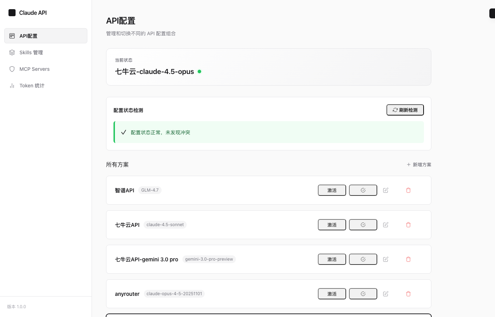
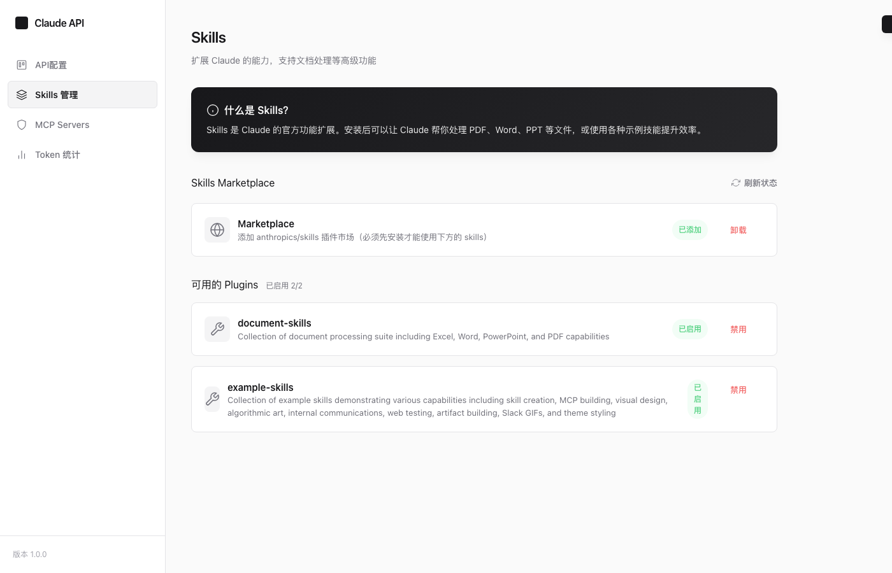
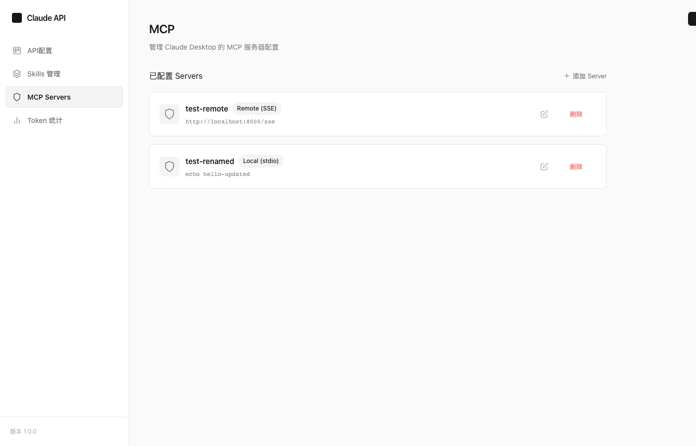

# Claude Code Config

[English](README.md) | [中文](README_zh.md)

A visual configuration manager for Claude Code CLI that supports multiple API profiles, token usage statistics, MCP server management, and official Skills installation.


## Screenshots

### API Configuration


### Skills Management


### MCP Server Management


### Token Statistics


---

## Features

- **Multi-Profile Management** - Create, edit, delete, and switch between multiple API configurations
- **Token Usage Statistics** - Track API calls and token consumption per profile and model
- **API Proxy** - Built-in proxy server that forwards requests to third-party API providers
- **MCP Server Management** - Manage Claude Desktop MCP server configurations
- **Skills Installation** - Install/uninstall official Anthropic Skills with one click
- **Config Conflict Detection** - Detect and fix conflicting environment variables in `.zshrc`
- **API Health Check** - Test API connectivity and latency

## Architecture

```
┌─────────────────────────────────────────────────────────────┐
│                      Web UI                                  │
│  http://localhost:3000                                       │
│  ├─ Profile Management (Add/Edit/Delete/Activate)           │
│  ├─ Token Statistics                                         │
│  ├─ MCP Server Management                                    │
│  └─ Skills Installation                                      │
└─────────────────────────────────────────────────────────────┘
                            ↓
┌─────────────────────────────────────────────────────────────┐
│                      Shell Wrapper                           │
│  ~/.claude-wrapper                                           │
│  └─ Auto-load config + Token tracking                       │
└─────────────────────────────────────────────────────────────┘
                            ↓
┌─────────────────────────────────────────────────────────────┐
│                    Claude CLI                                │
└─────────────────────────────────────────────────────────────┘
```

## Quick Start

### 1. Clone & Install

```bash
git clone https://github.com/PM-Shawn/Claude-Code-Config.git
cd Claude-Code-Config
npm install
```

### 2. Run Setup Script

```bash
bash setup.sh
source ~/.zshrc
```

### 3. Start the Server

```bash
npm start
# or
node server.js
```

Visit http://localhost:3000

## Usage

### Adding API Profiles

1. Click **"+ New Profile"**
2. Fill in the configuration:
   - **Profile Name**: e.g., "OpenRouter API", "Qiniu Cloud"
   - **API URL**: Third-party API endpoint, e.g., `https://api.qnaigc.com`
   - **API Key**: Your API key
   - **Model Name**: e.g., `claude-4.5-sonnet`

### Activating a Profile

Click the **"Activate"** button on any profile card. The activated profile will:
- Be used automatically when running `claude` commands in terminal
- Display with a green border highlight

### Using with Claude CLI

After activating a profile, use the `claude` command as usual:

```bash
# Interactive mode
claude

# Single prompt
claude -p "your prompt"

# JSON output (enables automatic token tracking)
claude -p --output-format json "your prompt"
```

## API Endpoints

| Endpoint | Method | Description |
|----------|--------|-------------|
| `/api/config` | GET/POST | Get/Save all configurations |
| `/api/profiles` | POST | Create a new profile |
| `/api/profiles/:id` | PUT/DELETE | Update/Delete a profile |
| `/api/profiles/:id/activate` | POST | Activate a profile |
| `/api/profiles/:id/test` | POST | Test API connectivity |
| `/api/token-stats` | GET/POST/DELETE | Token usage statistics |
| `/api/mcp/servers` | GET/POST | MCP server management |
| `/api/skills/status` | GET | Check Skills installation status |
| `/api/skills/install` | POST | Install official Skills |
| `/v1/messages` | POST | Proxy endpoint for API requests |

## Configuration Files

| File | Description |
|------|-------------|
| `config.json` | API profile storage |
| `token-stats.json` | Token usage statistics |
| `~/.claude-api-env` | Active environment variables |
| `~/.claude-wrapper` | Shell wrapper function |

## Tech Stack

- **Backend**: Node.js + Express
- **Frontend**: Vanilla HTML/CSS/JavaScript
- **Data Storage**: JSON files

## Project Structure

```
Claude-Code-Config/
├── server.js           # Web server
├── index.html          # Admin UI
├── config.json         # Config storage (git-ignored)
├── token-stats.json    # Stats data (git-ignored)
├── setup.sh            # Setup script
├── claude-activate.sh  # Activation script
└── package.json        # Dependencies
```

## License

MIT License

## Contributing

Pull requests are welcome. For major changes, please open an issue first to discuss what you would like to change.
